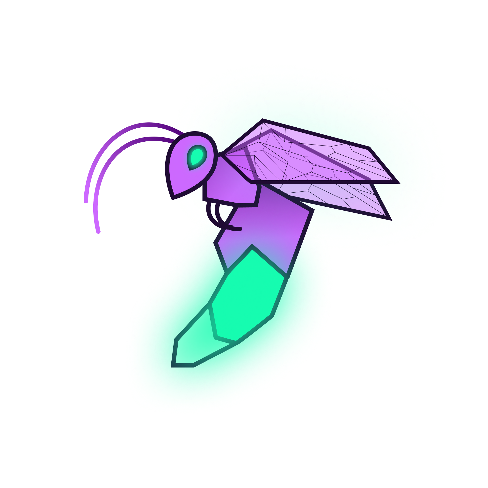
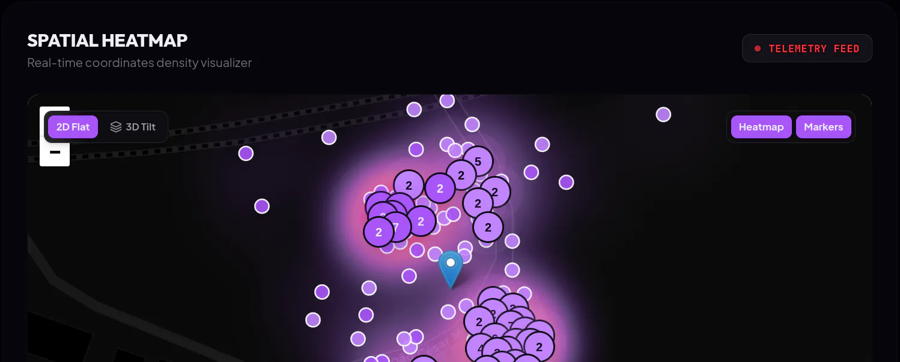
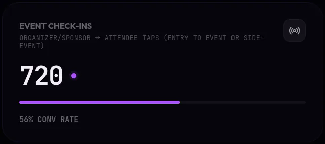
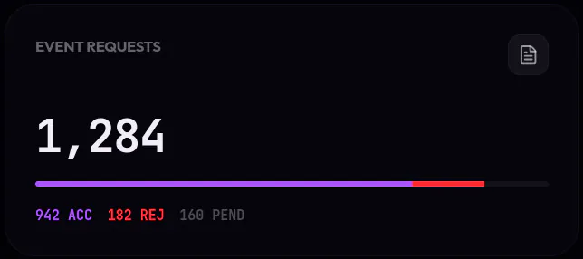
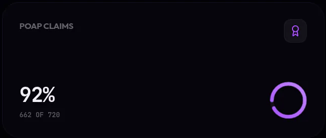
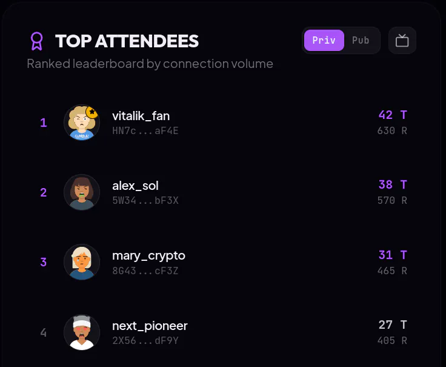

<p align="center">
  
</p>

<h1 align="center">NextVibe Organizer Portal</h1>

<p align="center">
  <b>See who came to your event and who met whom.</b><br/>
  The web dashboard for events that run check-ins and networking on <a href="https://nextvibe.io">NextVibe</a>.
</p>

<p align="center">
  <a href="https://dashboard.nextvibe.io"><b>dashboard.nextvibe.io</b></a> ·
  <a href="https://nextvibe.io">nextvibe.io</a> ·
  <a href="https://github.com/hardusss/NextVibe">Mobile app repo</a> ·
  <a href="https://telegra.ph/NextVibe-for-Event-Organizers-09-25">Organizer guide</a>
</p>

---

<p align="center">
  
</p>

<p align="center">
  
  
  
</p>

<p align="center"><sub>Screenshots from demo mode (sample data).</sub></p>

## How it fits together

At a NextVibe event, guests check in by tapping their phone to the organizer's phone (NFC or Bluetooth), inside the venue geofence and during event hours. They get a POAP on Solana. During the event, guests tap each other with **Tap to Meet** and both get a **Proof of Meet**.

Everything that happens at the door and in the room shows up here, live.

```
Luma event ──import──▶ NextVibe app ──taps──▶ NextVibe API ──▶ Organizer Portal
                        (check-in, Tap to Meet)                  (this repo)
```

## Features

**Overview**
- Check-ins and conversion rate, attendance requests (approved / rejected / pending), POAP claims
- Hourly activity timeline
- Auto-refresh with manual reload

**Where and with whom**
- **Spatial heatmap** of check-ins and networking taps (Leaflet, 2D and tilted 3D view, heatmap and marker layers)
- **Social graph** of who met whom at the event (d3-force, drag nodes, host highlighting)
- **Top attendees** leaderboard by connections, with a full-screen public mode for the venue screen

**Running the event**
- Create and edit events, review and approve attendance requests
- **Broadcast** push notifications to approved guests
- **Raffle** among attendees with payouts in SOL, USDC or USDT, signed with the organizer's own wallet
- Event posts from the event, in one place

**Sign in** with email (with a confirmation code), Google, or a Solana wallet. Any NextVibe account can organize events.

<p align="center">
  
</p>

## Run locally

Requires Node.js 20+.

```bash
git clone https://github.com/hardusss/nextvibe-organizers-portal.git
cd nextvibe-organizers-portal
npm install
cp .env.example .env.local   # optional, see below
npm run dev                  # http://localhost:3000
```

The portal talks to the **production NextVibe API** (`https://api.nextvibe.io/api/v1`) by default, so it works out of the box: sign in with your NextVibe account and you will see your own events. There is no need to run the backend.

| Variable | Required | Purpose |
|---|---|---|
| `NEXT_PUBLIC_API_URL` | no | API base URL, defaults to production |
| `NEXT_PUBLIC_GOOGLE_CLIENT_ID` | for Google sign-in | Google OAuth client ID |
| `NEXT_PUBLIC_SOLANA_RPC_URL` | for wallet features | Solana RPC for wallet sign-in and raffle payouts |

`npm run build` produces a static export in `out/` that can be hosted on any static host.

## Stack

Next.js 16 (App Router, static export) · React 19 · TypeScript · Tailwind CSS 4 · Framer Motion · d3-force · Leaflet + Leaflet.heat · Solana wallet adapter · web3.js

## Project structure

```
app/(auth)/login        sign-in
app/(dashboard)/        dashboard, events, attendees, settings, help
src/api/                API client (events, auth, wallet sign-in)
src/components/analytics  heatmap, social graph, timeline, raffle, broadcast
src/components/modals   create / edit event, event posts
src/contexts            demo mode, roles, mobile menu
```

The mobile-side event flow (Luma import, NV code verification, minting) is documented in [`event_creation_docs.md`](event_creation_docs.md).

## Related

- **[NextVibe](https://github.com/hardusss/NextVibe)** - the mobile app (Expo / React Native), API and Solana services
- **Solana dApp Store** - install NextVibe on Seeker from [nextvibe.io](https://nextvibe.io)

## License

© 2026 NextVibe. All rights reserved. The source is public for review; no license to reuse it is granted.

Questions or want to run NextVibe at your event? Telegram [@danylo_nv](https://t.me/danylo_nv) or help@nextvibe.io.
