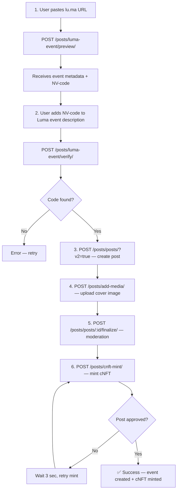

# NextVibe — Event Creation Flow (Full Documentation)

> Step-by-step guide on how to create an event with Luma integration on NextVibe.  
> Documented exactly as implemented on the frontend (React Native).

---

## Overall Flow



> [!IMPORTANT]
> After `finalize`, the post goes through AI moderation. Minting is only possible **after approval**. The frontend uses **polling** — it retries `cnft-mint` every 3 seconds until it receives `success` or a fatal error.

---

## Authentication

All endpoints require a **JWT Bearer** token in the `Authorization` header:

```
Authorization: Bearer <access_token>
```

---

## Step 1 — Preview Luma Event

Scrapes the Luma page and returns metadata + generates a verification code `NV-XXX`.

```
POST /posts/luma-event/preview/
```

### Request

```json
{
  "luma_url": "https://lu.ma/my-event"
}
```

### Response `200`

```json
{
  "status": "ok",
  "data": {
    "event": {
      "url": "https://lu.ma/my-event",
      "title": "NextVibe Meetup",
      "cover_image": "https://images.lumacdn.com/cover.jpg",
      "description": "Web3 networking event...",
      "location": {
        "name": "Hub 4.0",
        "address": "176 Antonovycha St, Kyiv",
        "url": "https://maps.google.com/...",
        "lat": 50.4501,
        "lng": 30.5234
      },
      "start_time": "2026-06-15T18:00:00+03:00",
      "end_time": "2026-06-15T22:00:00+03:00"
    },
    "code": "NV-472"
  }
}
```

> [!NOTE]
> The code is cached for **15 minutes** (key: `luma_verify:{user_id}:{luma_url}`).  
> If it expires, the user must call preview again.

### Accepted Hosts

`lu.ma`, `www.lu.ma`, `luma.com`, `www.luma.com`

### Errors

| Status | Error | Description |
|--------|-------|-------------|
| `400` | `invalid_luma_url` | URL is not a valid Luma link |
| `502` | `fetch_failed` | Could not load the Luma page |

---

## Step 2 — Verify Luma Event

Checks whether the NV-code is present on the Luma page (in description or full_text).  
The user must first **add the code to their Luma event description**, then tap Verify.

```
POST /posts/luma-event/verify/
```

### Request

```json
{
  "luma_url": "https://lu.ma/my-event"
}
```

> [!IMPORTANT]
> The `luma_url` **must be identical** to the one used in the preview step — the code is bound to the pair `{user_id}:{luma_url}`.

### Response `200`

```json
{
  "status": "ok",
  "data": {
    "verified": true,
    "code": "NV-472",
    "event": {
      "url": "https://lu.ma/my-event",
      "title": "NextVibe Meetup",
      "cover_image": "https://images.lumacdn.com/cover.jpg",
      "description": "Web3 networking event... NV-472",
      "location": { "name": "Hub 4.0", "address": "...", "lat": 50.45, "lng": 30.52 },
      "start_time": "2026-06-15T18:00:00+03:00",
      "end_time": "2026-06-15T22:00:00+03:00"
    }
  }
}
```

- `verified: true` — code found, proceed to create the post
- `verified: false` — code not found, user needs to add it and try again

### Errors

| Status | Error | Description |
|--------|-------|-------------|
| `400` | `invalid_luma_url` | Invalid URL |
| `400` | `no_code_or_expired` | Code expired or preview was never called |
| `502` | `fetch_failed` | Luma is unreachable |

---

## Step 3 — Create Event Post

Creates a post with Luma event flags. Must use `?v2=true` for H3 geocoding.

```
POST /posts/posts/?v2=true
```

### Request

```json
{
  "about": "NextVibe Meetup — Web3 social networking",
  "owner": 42,
  "location": "Hub 4.0 · 176 Antonovycha St, Kyiv",
  "coords": { "lat": 50.4501, "lng": 30.5234 },
  "resolution": 11,
  "is_ai_generated": false,
  "is_comments_enabled": true,
  "is_luma_event": true,
  "luma_event_url": "https://lu.ma/my-event",
  "luma_event_verified": true,
  "luma_event_start_time": "2026-06-15T18:00:00+03:00",
  "luma_event_end_time": "2026-06-15T22:00:00+03:00"
}
```

### Fields

| Field | Type | Required | Description |
|-------|------|----------|-------------|
| `about` | string | ✅ | Event description (max 255 chars) |
| `owner` | int | ✅ | User ID of the creator |
| `location` | string | ❌ | Human-readable address |
| `coords` | `{lat, lng}` | ✅ | Coordinates for H3 geocoding |
| `resolution` | int | ✅ | H3 resolution (**frontend uses 11**) |
| `is_luma_event` | bool | ✅ | Must be `true` |
| `luma_event_url` | string | ✅ | Verified Luma URL |
| `luma_event_verified` | bool | ✅ | Must be `true` after verification |
| `luma_event_start_time` | ISO datetime | ❌ | Start time from Luma |
| `luma_event_end_time` | ISO datetime | ❌ | End time from Luma |
| `is_ai_generated` | bool | ❌ | `false` for events |
| `is_comments_enabled` | bool | ❌ | Default `true` |

> [!WARNING]
> **Online events are not supported.** If `location` = `"Online"`, the frontend blocks creation.  
> Coordinates (`coords`) are mandatory — without them the event won't appear on the VibeMap.

### Response `201`

```json
{
  "id": 123,
  "about": "NextVibe Meetup",
  "is_luma_event": true,
  "luma_event_url": "https://lu.ma/my-event",
  "luma_event_verified": true,
  "moderation_status": "pending",
  "h3_geo": "8b1f05b4a5e3fff"
}
```

Save the `id` — it's needed for the next steps.

---

## Step 4 — Upload Media (cover image)

Uploads the Luma cover image as media attached to the post.

```
POST /posts/add-media/
Content-Type: multipart/form-data
```

### Form Data

| Field | Type | Description |
|-------|------|-------------|
| `post` | int | Post ID from Step 3 |
| `media` | file | Image file |

> [!NOTE]
> On the frontend, the Luma cover image is first downloaded as a temporary file, then uploaded via `FileSystem.uploadAsync`.

### Response `201`

```json
{
  "id": 456,
  "post": 123,
  "file": "https://cdn.nextvibe.app/posts_media/cover.jpg"
}
```

---

## Step 5 — Finalize (trigger moderation)

Triggers AI moderation via a Celery task.

```
POST /posts/posts/{post_id}/finalize/
```

### Response `200`

```json
{
  "status": "moderation_started",
  "message": "Post submitted for review"
}
```

After this, the post gets `moderation_status = "pending"`. When moderation passes successfully — `is_approved = true`.

---

## Step 6 — Mint cNFT (with polling)

Mints a compressed NFT for the event. **This is the first edition mint (owner mint).**

```
POST /posts/cnft-mint/
```

### Request

```json
{
  "walletAddress": "",
  "postId": 123,
  "price": 0,
  "paymentSignature": ""
}
```

> [!IMPORTANT]
> For owner-mint (edition 1), the fields `walletAddress`, `price`, `paymentSignature` can be empty/zero.  
> The backend takes `wallet_address` from the authenticated user's profile.

### Frontend Polling Logic

```typescript
// The frontend runs a retry loop:
while (true) {
    const res = await mintNFT("", postId, 0, "");
    
    if (res.success) {
        // ✅ Mint successful — done!
        break;
    } else if (res.error === "Post is not approved.") {
        // ⏳ Moderation not finished yet — wait 3 sec
        await sleep(3000);
        continue;
    } else {
        // ❌ Fatal error — stop
        break;
    }
}
```

### Response `201` (success)

```json
{
  "success": true,
  "edition": 1,
  "assetId": "5xKX...abc",
  "signature": "2xYZ...def"
}
```

### Possible Errors

| Status | Error | Description |
|--------|-------|-------------|
| `400` | `Post is not approved.` | Moderation not finished yet — **retry** |
| `400` | `User wallet address is not set.` | User hasn't linked a wallet |
| `400` | `Edition sold out.` | All NFTs have been minted |
| `400` | `You already minted this post.` | User already has an NFT for this post |
| `400` | `Missing required fields.` | No `postId` provided |
| `503` | `Mint service connection error.` | Mint microservice is unavailable |

---

## Updating Event Data

Updates event fields (such as description, location, coordinates, start/end time, and total supply). Only the event owner can perform this action.

```
PATCH /posts/event-update/{post_id}/
```

### Request

```json
{
  "about": "Updated description",
  "location": "Updated location name",
  "coords": {
    "lat": 50.4501,
    "lng": 30.5234
  },
  "resolution": 11,
  "luma_event_start_time": "2026-06-15T19:00:00+03:00",
  "luma_event_end_time": "2026-06-15T23:00:00+03:00",
  "total_supply": 100
}
```

> [!NOTE]
> - All fields are optional.
> - If `coords` are supplied, the backend automatically recalculates `h3_geo` using the provided `resolution` (defaults to `11` if not specified).
> - `total_supply` cannot be updated to a number lower than `minted_count`.

### Response `200` (success)

```json
{
  "success": true,
  "id": 123,
  "about": "Updated description",
  "location": "Updated location name",
  "h3_geo": "8b1f05b4a5e3fff",
  "luma_event_url": "https://lu.ma/my-event",
  "luma_event_start_time": "2026-06-15T19:00:00+03:00",
  "luma_event_end_time": "2026-06-15T23:00:00+03:00",
  "total_supply": 100,
  "minted_count": 1
}
```

### Errors

| Status | Error | Description |
|--------|-------|-------------|
| `400` | `This post is not registered as a Luma event.` | The post is a regular post, not a Luma event |
| `400` | `Invalid coordinates or resolution: <msg>` | Invalid format for coords |
| `400` | `Invalid start/end time format (expected ISO 8601).` | ISO format parsing failed |
| `400` | `Total supply cannot be less than minted count.` | Decreasing supply below actual mints is blocked |
| `403` | `Not authorized to update this event.` | User is not the owner |
| `404` | `Not Found` | Event post doesn't exist |

---

## Deleting Event

Events can be deleted (hidden) using the generic post delete endpoint. This soft-deletes the event by setting `is_hide = True` on the post and decrements the user's `post_count`. Only the event owner can perform this action.

```
DELETE /posts/delete-post/?postId={id}
```

### Response `200` (success)

```json
{
  "data": "Post deleted"
}
```

### Errors

| Status | Error | Description |
|--------|-------|-------------|
| `400` | `You can't delete post another user` | User is not the owner |
| `404` | `Post not foud, check post id` | Post does not exist or `postId` query parameter is missing |

---

## Complete Endpoint List (creation flow)

| Step | Method | Endpoint | Description |
|------|--------|----------|-------------|
| 1 | `POST` | `/posts/luma-event/preview/` | Get metadata + NV-code |
| 2 | `POST` | `/posts/luma-event/verify/` | Verify NV-code on Luma page |
| 3 | `POST` | `/posts/posts/?v2=true` | Create post with event fields |
| 4 | `POST` | `/posts/add-media/` | Upload cover image |
| 5 | `POST` | `/posts/posts/{id}/finalize/` | Trigger moderation |
| 6 | `POST` | `/posts/cnft-mint/` | Mint cNFT (with polling) |
| - | `PATCH`| `/posts/event-update/{post_id}/` | Update event metadata |
| - | `DELETE`| `/posts/delete-post/?postId={id}` | Delete (hide) event |

---

## Frontend State Machine

The `AddLumaEventSheet` component uses these process states:

```
"idle" → "posting" → "minting" → "success"
                  ↘             ↘
                 "error"       "error"
```

| State | What the user sees | What happens |
|-------|-------------------|--------------|
| `idle` | Button "Create post and cNFT mint ✦" | Waiting for tap |
| `posting` | "Creating post..." | Steps 3 + 4 + 5 |
| `minting` | "Minting cNFT..." | Step 6 (polling) |
| `success` | "Success! ✓" | Sheet dismisses after 2 sec |
| `error` | Red error message | User can retry |

---

## Frontend File References

| File | Purpose |
|------|---------|
| [AddLumaEventSheet.tsx](file:///home/hard/NextVibe/frontend/NextVibe/components/Events/AddLumaEventSheet.tsx) | Main UI component: preview → verify → create → mint |
| [luma.event.ts](file:///home/hard/NextVibe/frontend/NextVibe/src/api/luma.event.ts) | API: `previewLumaEvent()`, `verifyLumaEvent()` |
| [create.post.ts](file:///home/hard/NextVibe/frontend/NextVibe/src/api/create.post.ts) | API: `createPost()` with `LumaEvent` interface |
| [mint.nft.ts](file:///home/hard/NextVibe/frontend/NextVibe/src/api/mint.nft.ts) | API: `mintNFT()` for cNFT minting |

## Backend File References

| File | Purpose |
|------|---------|
| [luma_event.py](file:///home/hard/NextVibe/backend/NextVibeAPI/posts/view_pac/luma_event.py) | `LumaEventPreviewView`, `LumaEventVerifyView` — scraping + verification |
| [post_create.py](file:///home/hard/NextVibe/backend/NextVibeAPI/posts/view_pac/post_create.py) | `PostViewSet` — post creation + finalize |
| [event_update.py](file:///home/hard/NextVibe/backend/NextVibeAPI/posts/view_pac/event_update.py) | `EventUpdateView` — update event metadata |
| [delete_post.py](file:///home/hard/NextVibe/backend/NextVibeAPI/posts/view_pac/delete_post.py) | `DeletePostView` — soft delete posts and events |
| [mint_nft.py](file:///home/hard/NextVibe/backend/NextVibeAPI/posts/view_pac/mint_nft.py) | `MintNftView` — cNFT minting via microservice |
| [models.py](file:///home/hard/NextVibe/backend/NextVibeAPI/posts/models.py) | `Post`, `UserCollection` — data models |

